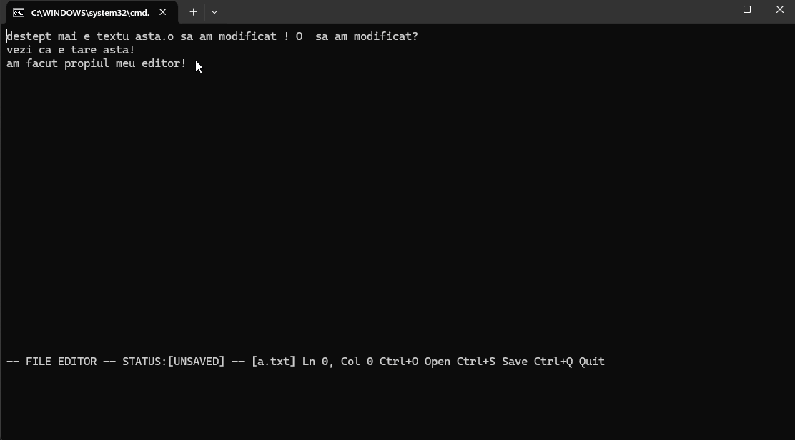
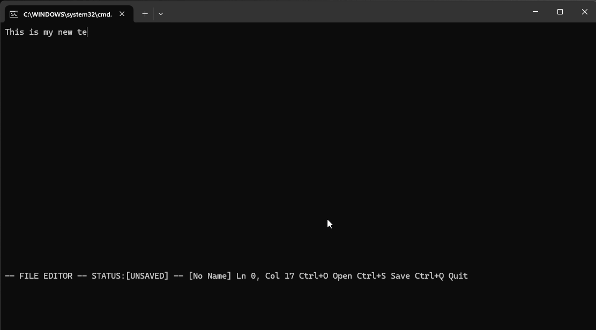
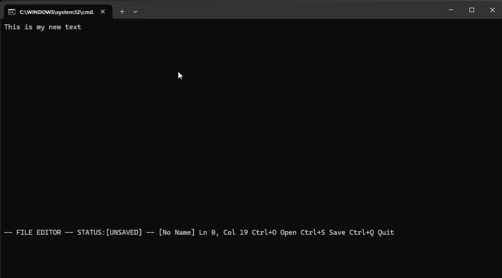
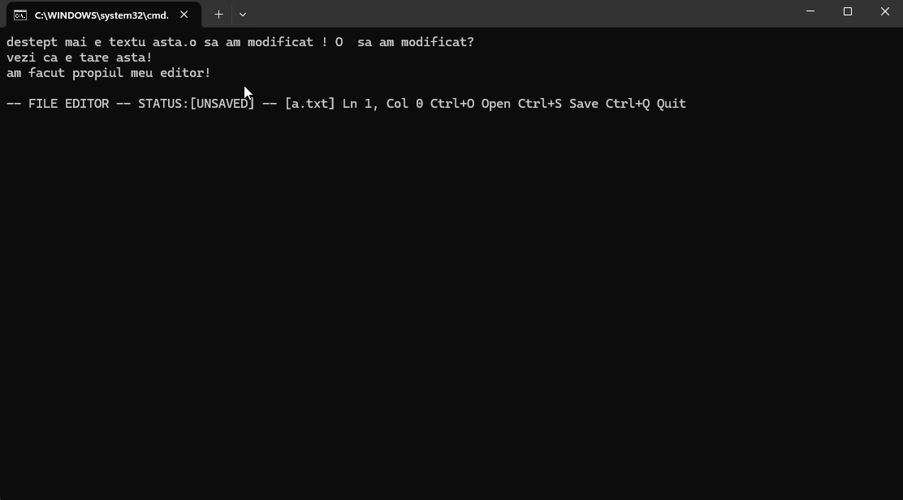

# Nilac Text Editor

A minimal terminal-based text editor written in Python.  
The project focuses on implementing the core mechanics of text editing—buffer structures, input handling, rendering, and reversible operations—without relying on `curses`, GUI frameworks, or prebuilt widgets.

The result is a compact, transparent example of how editors work internally.

---

## Features

### Buffer Model
Text is stored as a list of character lists:

```python
buffer = [list_of_chars_per_line]
```

The cursor is tracked as `(row, col)`, and viewport scrolling is managed through `top_line` and `left_col`.

Supported editing operations:

- Character insertion and deletion  
- Line splitting and joining  
- Multi-line editing  

---

### Undo / Redo
Each modification is recorded as an operation object (e.g., character insert, line split).  
Undo applies the inverse of the most recent operation; redo reapplies the original.

This supports:

- Character edits  
- Line splits/joins  
- Replace-all operations  

---

### Search & Highlight
Search is a multi-line substring scan.  
Results are stored as `(row, start, end)` tuples.

Highlighting is applied during rendering through ANSI codes.  
The buffer itself remains untouched.

---

### Replace All
Global replace is implemented via grouped delete/insert operations to maintain undo correctness.

---

### Navigation
Supported navigation:

- Arrow keys  
- Home / End  
- Ctrl+Left / Ctrl+Right (word navigation)  
- Page Up / Page Down  

Hotkeys:

- **Ctrl+O** – Open file  
- **Ctrl+S** – Save  
- **Ctrl+Z** – Undo  
- **Ctrl+Y** – Redo  
- **Ctrl+/** – Search  
- **Ctrl+Q** – Quit  
- **Ctrl+N** – New File  

---

## Rendering
Rendering uses manual ANSI cursor movement and slicing:

```python
visible = full_line[from_col:to_col]
```

During search mode, the renderer overlays highlight spans within the visible range.

---

## Input Handling
The editor processes key events in real time through the `keyboard` module:

```python
buffer_op.record_key(key)
```

This includes navigation, editing, and command hotkeys.

*Note:* The `keyboard` module has platform-specific constraints and may require elevated permissions on some systems.

---

## File I/O
Basic load/save logic:

```python
buffer = [list(line.rstrip("\n")) for line in f]
```

The last opened file path is stored in `editor.ini`.

---

## Screenshots / GIFs

Recommended format:

1. Basic editing  
2. Undo/redo demonstration   
3. Search + highlight  
4. Replace-all example 

---

## Challenges & Lessons Learned

Implementing an editor manually requires solving problems typically abstracted away:

- Cursor/scroll coordination  
- Flicker-free terminal rendering  
- Reversible state transitions for undo/redo  
- Multi-line edits with consistent invariants  
- Non-destructive highlight rendering  

These constraints shaped the structure of the buffer model and operation system.

---

## Running the Editor

**Requirements**

- Python 3.10+  
- `keyboard` module  

**Install**

```bash
pip install keyboard
```

**Run**

```bash
python main.py 
```

**Windows:**  
A `run.bat` file is included for convenience.

---

## Project Scope

This project demonstrates core concepts behind text editors:

- Buffer architecture and state transitions  
- Manual terminal rendering  
- Input/event handling  
- Undo/redo mechanisms  
- Search and replace  

It’s designed to be clear, direct, and easy to reason about — suitable as both a learning tool and a structured portfolio project.

---

## License
MIT