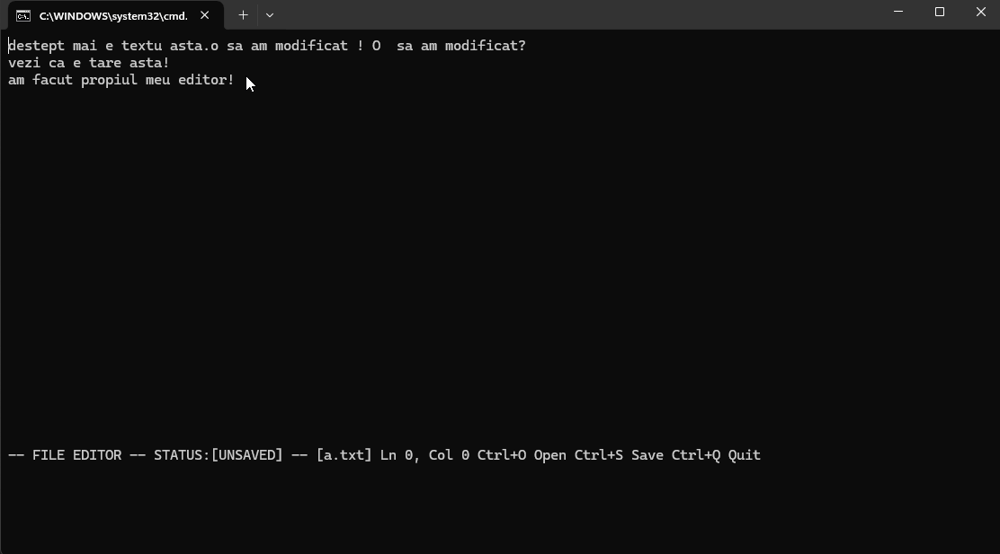
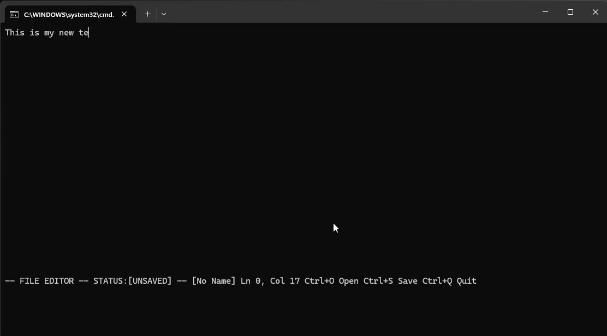
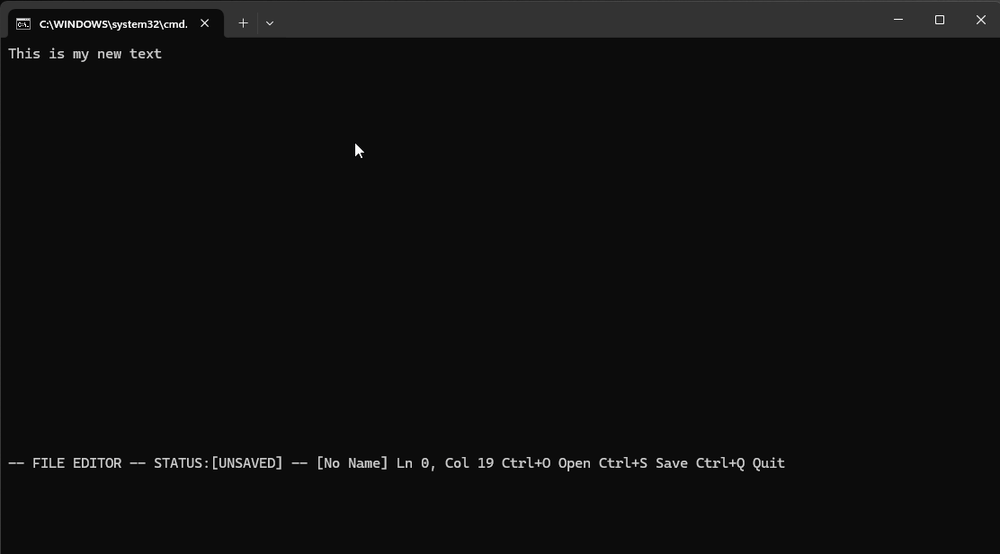
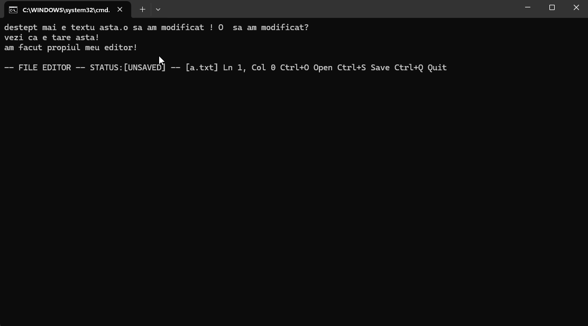

# Nilac Text Editor


Nilac Text Editor is a minimal terminal-based text editor written in Python from scratch. It focuses on demonstrating editor internals such as mutable text buffer management, cursor and viewport state, manual terminal rendering, undo/redo using reversible operations, search highlighting, replace-all behavior, and file loading/saving.

This is a portfolio and educational project, not a production editor or a package intended for public distribution.

## Demo

The repository includes GIF demos showing the editor's core behavior:

- Typing and navigation: 
- Undo and redo: 
- Search/save workflow: 
- Replace-all behavior: 

## Features

- Mutable line buffer represented as lists of characters.
- Cursor movement across rows, columns, line boundaries, and words.
- Vertical and horizontal viewport scrolling.
- Manual terminal rendering with ANSI cursor movement.
- Undo and redo for reversible edit operations.
- Search result tracking and ANSI highlighting.
- Replace-all support with undo integration.
- Basic file open, save, new-file, and last-file restore behavior.

## Why This Project Matters

Text editors hide a surprising amount of state management behind simple interactions. This project keeps those mechanics visible by implementing the core behavior directly instead of relying on `curses`, GUI frameworks, or editor widgets.

## Architecture Overview

The editor is split into two main modules:

- `buffer_op.py` owns the mutable text buffer, cursor position, viewport offsets, search matches, and undo/redo stacks.
- `main.py` owns the terminal event loop, rendering, prompts, hotkeys, and file workflow.

Text is stored as a list of lines, where each line is a list of characters. Editing actions are represented as operation dictionaries, then applied through a central dispatcher so undo and redo can reverse or replay the same logical changes.

See [docs/architecture.md](docs/architecture.md) for a fuller explanation of the design.

## Running Locally

Requirements:

- Python 3.10+
- `keyboard`

Install dependencies:

```bash
pip install -r requirements.txt
```

Run the editor:

```bash
python main.py
```

On Windows, `run.bat` is also included as a convenience launcher.

## Controls

| Control | Action |
| --- | --- |
| Arrow keys | Move cursor |
| Home / End | Move to start or end of line |
| Ctrl+Left / Ctrl+Right | Move by word |
| Page Up / Page Down | Move by viewport page |
| Ctrl+O | Open file |
| Ctrl+S | Save file |
| Ctrl+N | Create a new file |
| Ctrl+Z | Undo |
| Ctrl+Y | Redo |
| Ctrl+/ | Search |
| Ctrl+R | Replace all |
| Esc | Exit search mode |
| Ctrl+Q | Save and quit |

## Testing

The test suite covers core editor behavior such as insert/delete, undo/redo, line split/join, search, replace-all, cursor movement, page navigation, file loading, and buffer reset/clear behavior.

Run tests with:

```bash
pytest
```

## Project Structure

```text
.
|-- assets/                 Demo GIFs
|-- docs/                   Project documentation
|-- tests/                  pytest coverage for buffer operations
|-- buffer_op.py            Buffer, cursor, viewport, search, and undo/redo logic
|-- main.py                 Terminal rendering, input loop, hotkeys, and file I/O
|-- requirements.txt        Runtime dependencies
|-- pyproject.toml          Test, formatting, and linting configuration
|-- run.bat                 Windows launcher
|-- LICENSE                 MIT license
`-- README.md              Project overview
```

## Known Limitations

- Uses terminal-specific rendering and input behavior.
- Keyboard/input handling may vary across operating systems.
- The `keyboard` package may require elevated permissions depending on the OS.
- No mouse support.
- No syntax highlighting.
- No tabs or multiple open files.
- Intended as a portfolio/learning project, not a production editor.

## Future Improvements

- Refactor global editor state into an `EditorState` object.
- Replace dictionary-based operations with typed operation dataclasses.
- Add syntax highlighting.
- Add line numbers.
- Add dirty-state tracking.
- Improve cross-platform input handling.
- Add more tests for edge cases.

## License

MIT
